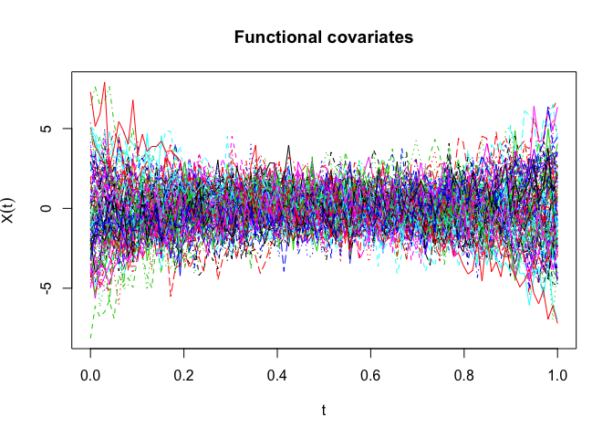
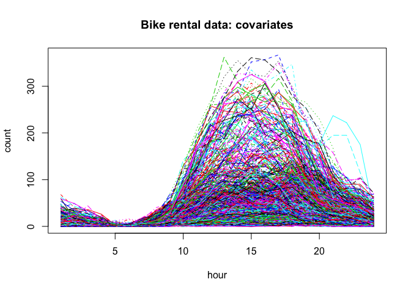
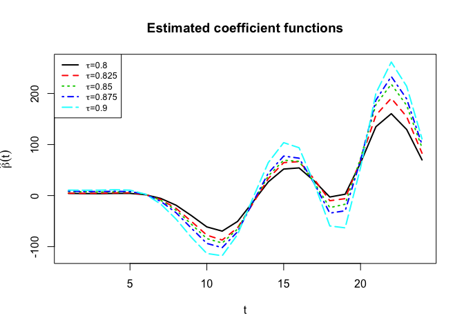
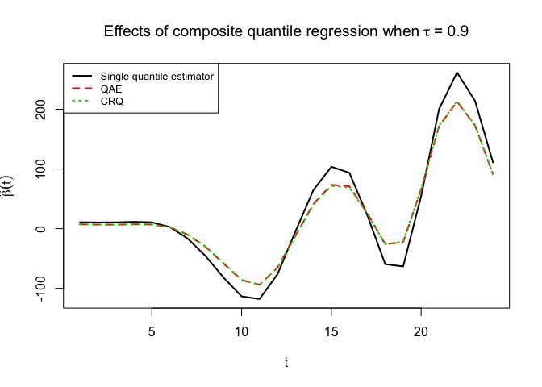

    source('source_fQR.R')

    ### examples to visualize simulated data ------
    n.tp = 100
    sim_data <- sim.fQR(n.sub = 100, n.tp = n.tp, eigen.basis = "legendre.polynomials")

    ## Functional covariates: 
    ##  eigen.value = 1 0.5 0.25 
    ##  eigen.function = legendre.polynomials

    matplot(x = seq(from = 0, to = 1, length = n.tp), t(sim_data$X), type="l", 
            xlab = expression(t), ylab = expression(X(t)), main = "Functional covariates")

    ### real data example using the bike rental data set ----
    load("bike_data.RData")

    matplot(x = 1:24, t(X), type="l", 
            xlab="hour", ylab="count", main = "Bike rental data: covariates")

    taus = c(0.8,0.825,0.85,0.875,0.9)
    ret = fQR(Y, X, taus = taus, pve = 0.99)

    # plot beta.hat for each quantile level 
    matplot(x = 1:24, ret$beta.hat, 
            type = "l", col = 1:length(taus), lty = 1:length(taus), lwd = 2,
            xlab=expression(t), ylab = expression(hat(beta)(t)), 
            main = "Estimated coefficient functions")

    legend("topleft", legend = c(expression(paste(tau,"=0.8")),
                                 expression(paste(tau,"=0.825")),
                                 expression(paste(tau,"=0.85")),
                                 expression(paste(tau,"=0.875")),
                                 expression(paste(tau,"=0.9"))), 
           col = 1:length(taus), lwd=rep(2, ret$K),lty = 1:length(taus), cex=0.8)

    # pvalue for constancy slope test 
    ret$pvalue

    ## [1] 0.2991717

    ### Composite Quantile regression ---- 

    # Method 1: QAE
    b.QAE = apply(ret$coef[-1,],1,mean)  
    beta.QAE = ret$x.fpca$efunctions %*% b.QAE

    # Method 2: CRQ 
    CRQ = crq.fit.func(Y,ret$x.fpca$scores,taus)
    a.CRQ = CRQ[1,]
    b.CRQ = CRQ[-1,1]
    beta.CRQ = ret$x.fpca$efunctions %*% b.CRQ

    ## focus on the 0.9th quantile 
    coef.matrix <- cbind(RQ = ret$coef[-1, ret$K], b.QAE, b.CRQ)
    beta.matrix <- ret$x.fpca$efunctions %*% coef.matrix

    # plot beta.hat for each quantile level 
    matplot(x = 1:24, beta.matrix, 
            type = "l", col = 1:3, lty = 1:3, lwd = 2,
            xlab=expression(t), ylab = expression(hat(beta)(t)), 
            main = expression("Effects of composite quantile regression when" ~ tau ~ "= 0.9"))

    legend("topleft", legend = c("Single quantile estimator", 
                                 "QAE", "CRQ"), 
           col = 1:3, lwd=rep(2, 3),lty = 1:3, cex=0.8)

